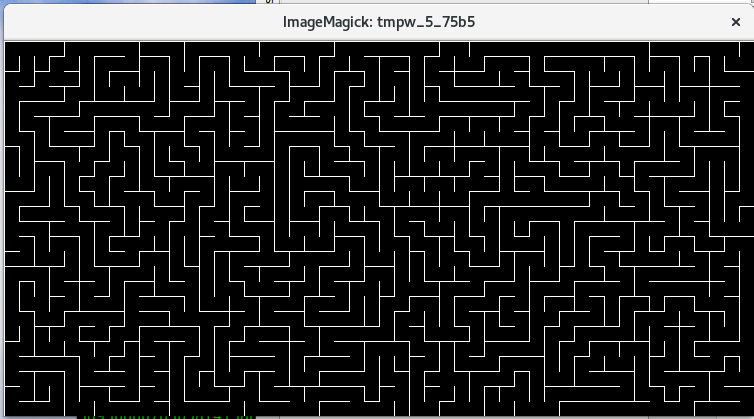
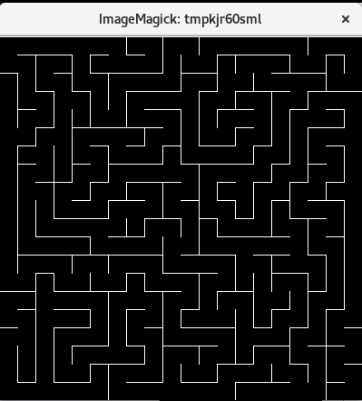

# Python Maze Generator
Generate a simple maze using the depth-first algorithm

## How to Use
1. ```$ pip install -r requrirements.txt```
2. `python maze.py`

## Configuration
- Set number of cells for width/height or how many pixels for cell wall  
```maze = Maze(width=50, height=25, cell_width=15)```  


- Or just use the defaults!  
```maze = Maze()```
